# 原fastreid框架流程解析


### 

## 笔者认为了解一段代码、一个项目最好的方式就是微观到宏观，笔者将会从运行python项目的train_net.py文件开始解析，然后再从宏观上俯瞰整个框架。

------


#### 写在前面：阅读fastreid需要行人重识别、神经网络和python基础，如果对以上三个不熟悉的话可能略有困难。此外，本文在笔者认为重要或者不易理解的部分添加了链接或者注释，希望有所帮助。


------


### 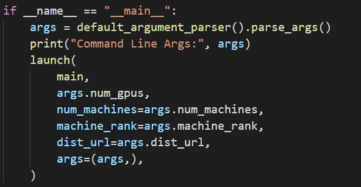

[下划线知识](https://www.runoob.com/w3cnote/python-5-underline.html)

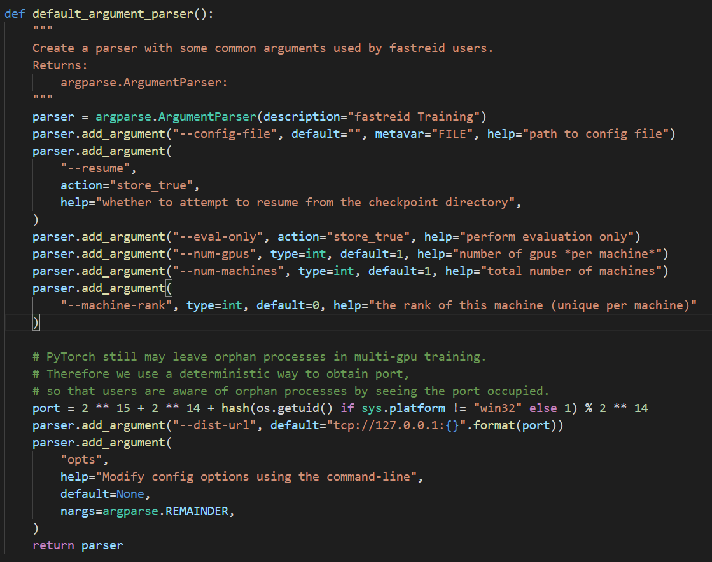

args获取到了命令行的参数（[命令行传参](https://docs.python.org/zh-cn/3/library/argparse.html)），config_file文件是配置文件，eval_only代表进行训练还是进行测评，还涉及了GPU数量机器数量，多机器的tcp端口地址等，结果保存到了args中，然后调用launch函数，这里我们考虑简单情况，直接执行了main函数

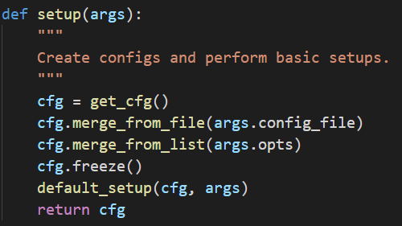

main中首先根根据args生成了对应的cfg

### [关于基础配置文件]([https://blog.csdn.net/gefeng1209/article/details/90668882]())

<!--文件位置在fastreid\config\defaults.py-->

defaults.py设置了关于神经网络的众多参数，以及一些选项，简单举例：

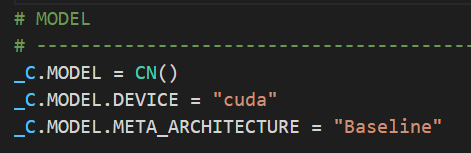

用的基本框架是baseline

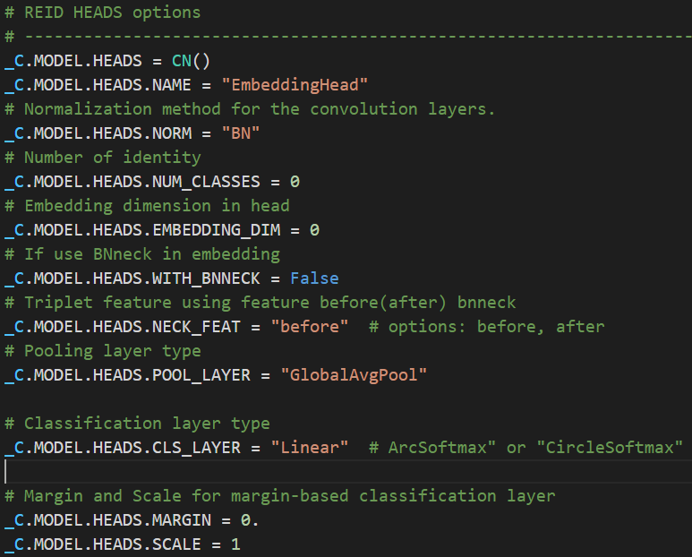

分类模块使用的是EmbeddingHead,以及HEAD.NUM_CLASS初始值为0，池化层采用GlobalAvgPool全局平均池化方式，分类层采用线性Linear等等

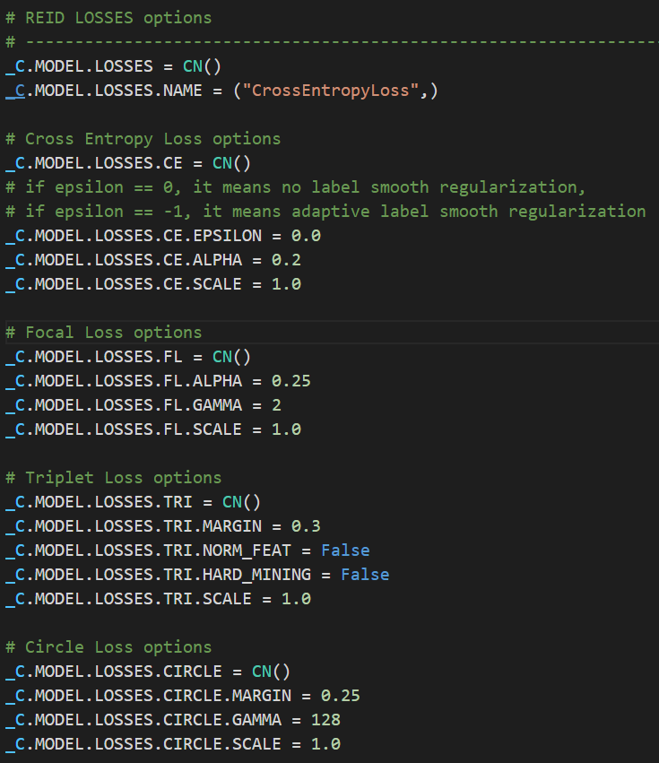

损失函数默认采用交叉熵损失，还定义了包括焦点损失、三元组损失、圆损失等 多种损失函数的参数，可以根据不同的评估模型、评估对象、评估方法自行切换


回到这里，merge_from_file就是将引入的文件与基础文件进行合并，达到更新基础配置，针对特定的模型方法对象切换最适合的框架的作用，可以查看选择合并的文件

笔者以fastreid给的案例为例，下面是命令行

```python
python3 tools/train_net.py --config-file ./configs/Market1501/bagtricks_R50.yml MODEL.DEVICE "cuda:0"
```

找到对应的config文件位置

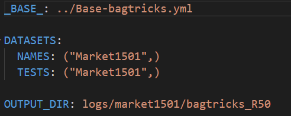

可以看到又调用了Base_bagtricks.yml

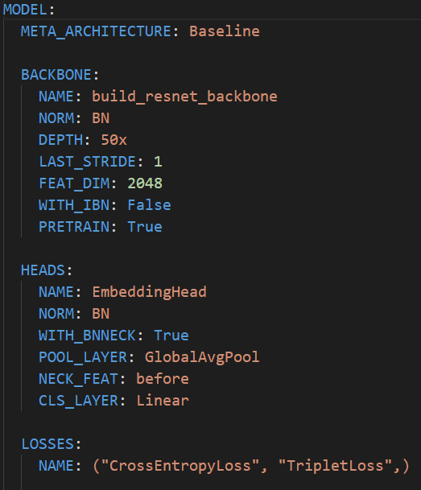

不难发现有一些熟悉的定义，这样就完成了初步的合并，并且更新了神经网络的基础配置，开启或关闭了一些选项


merge_from_list是把命令行传入的参数也更新到cfg中，举例：

<!--注：所有执行命令行中的“ \ " 都是表示python交互式模式下的换行符号，如不需要换行删掉” \ "-->

```python
python3 tools/train_net.py --config-file ./configs/Market1501/bagtricks_R50.yml --attack-by --defend-by\
MODEL.WEIGHTS ./model/market_bot_R50.pth MODEL.ATTACKMETHOD "FGSM" MODEL.DEFENCEMETHOD "GRAD"  MODEL.DEVICE "cuda:0"
```

主程序为train_net.py

--attack-by 表示用某种方法进行攻击
--defend-by 表示用某种方法进行防御,与config-file类似，可以自行定义

MODEL.WEIGHTS 表示模型的权重，后面的地址为你需要测评的已经训练好的模型的位置
MODEL.ATTACKMETHOD 表示攻击的方法， 与attack-by配合使用，后面为你所使用的攻击算法名称
MODEL.DEFENCEMETHOD 表示防御的方法， 与defend-by配合使用，后面为你所使用的防御算法名称
MODEL.DEVICE "cuda:0" 表示使用单个GPU训练，如需使用多个GPU或者多台计算机完成训练，请查阅源fastreid中运行文件，这里不再赘述

最后冻结cfg，返回的cfg表示配置文件的一个大的集合，包含了众多信息

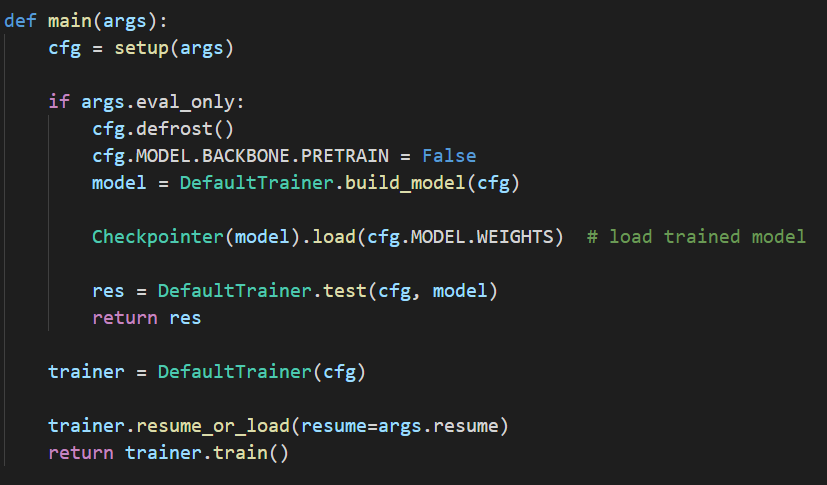

如果args中，即命令行中有eval_only这参数，则进入评估阶段，否则进入训练阶段

因为评估阶段在训练阶段也有体现，所以直接介绍训练阶段，下面由于代码众多，笔者将只截取重要部分进行讲解

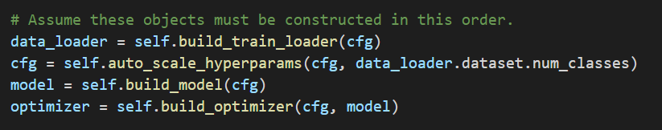


根据cfg返回了一个默认训练器的class类，其中返回了训练集数据，根据训练集标签数定义输出层节点个数，创建模型，创建优化器

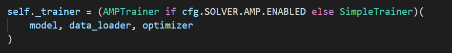

改类中定义了训练器，根据cfg中的一个选项来决定定义类方法，这两个类均继承了基类TrainerBase，并重写了run_step()方法

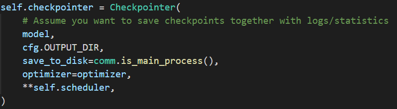

类中还定义了一个检测点，用于将训练程序多段执行，依次训练一部分并测评，然后保存结果，然后读取记录再次训练

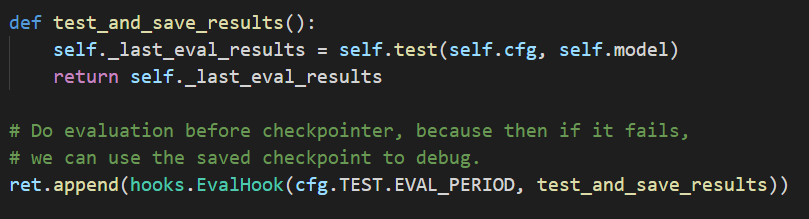

改函数就是用于一段epoch停下来检测保存，并返回测评结果

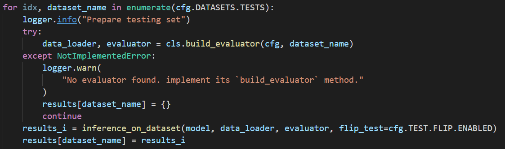

测评方式为根据cfg中的记录生成对应的测试集，评估器，然后进行评测

这里笔者简单介绍一下行人重识别的训练以及评测方式：数据集分为训练集，为行人图片带有标签；神经网络根据训练集进行训练，完成特征提取和分类，特征提取由backbone实现，分类由EmbeddingHead实现（后面会介绍），然后训练得到一个模型。测试集分为请求集(query_set)和查询集(gallery_set)，一般来讲训练集和测试集的行人标签没有交集，所以对于某一张请求集或者测试集的图片训练好的网络无法将他们与标签一一对应，然后网络可以做到特征提取和分类。请求集和查询集拥有同一组人物标签，根据分别将请求集和查询集通过网络进行判断，网络可以将他们分类得到一些相近特征的图片，然后根据这些相近的图片的标签命中个数来评估整个模型的优劣，一般的评测指标由Rank-1，Rank-5，mAP,mINP等

测评方法位置：fast-reid-master\fastreid\evaluation\reid_evaluation.py

测评流程结束

------

接下来介绍一下神经网络的结构

网络的总体架构位置：fast-reid-master\fastreid\modeling\meta_arch\baseline.py

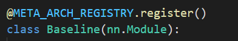

所有的神经网络的类都通过装饰器预先保存，方便直接调用，这一点很巧妙

注册类位置：fast-reid-master\fastreid\utils\registry.py

注册器实现：

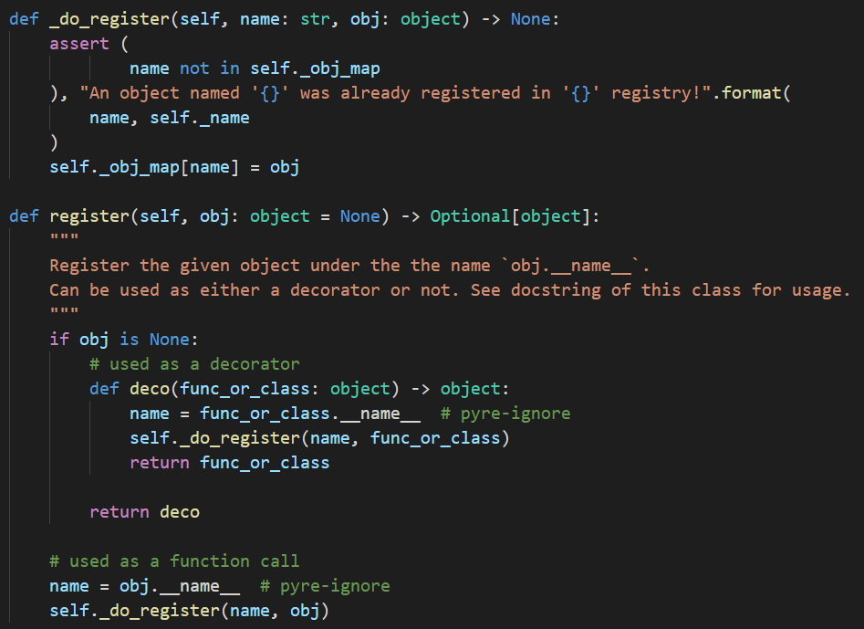

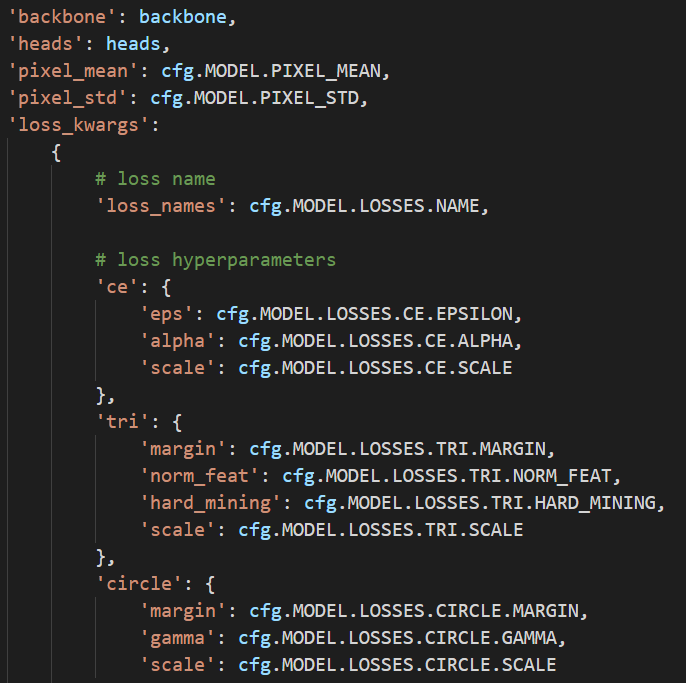

传入baseline的参数，backbone默认使用的都是resnet系列的，heads采用EmbeddingHead，以及像素偏差值基准值，损失函数参数

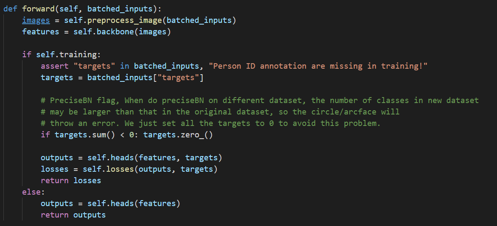

forward函数，继承nn.module类的网络都会因call自行调用forward

把输入的图片转换成矩阵，训练集为64x3x256x128 （batch_size x channel x height x weight ) ,测试集为20~

然后根据训练模式还是评测模式返回损失函数还是预测对象

backbone为resnet，这里不做赘述

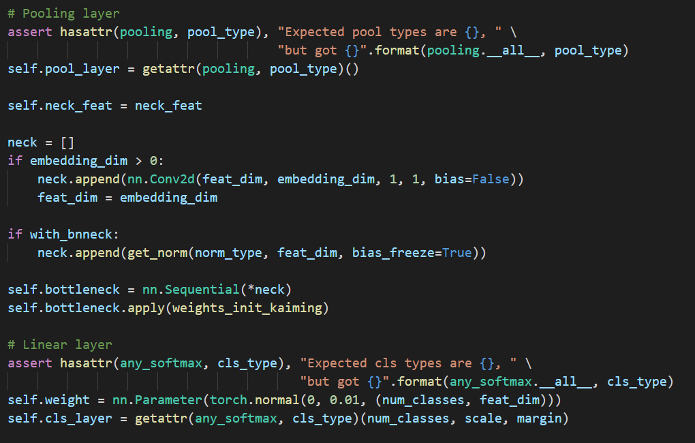

EmbeddingHead定义了池化层，瓶颈层和分类层

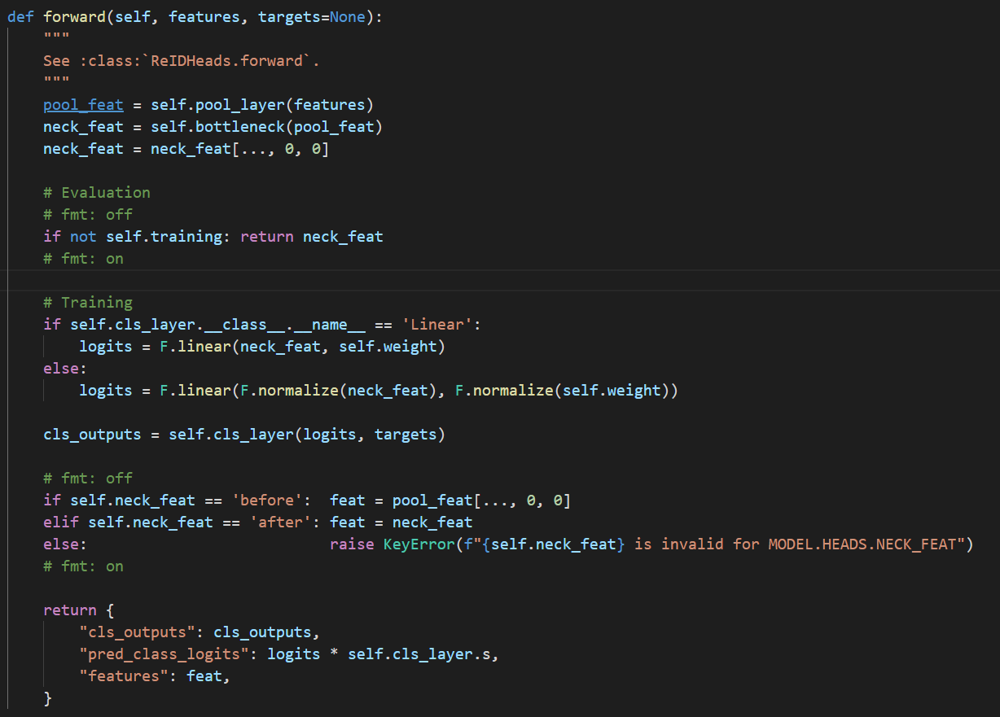

EmbeddingHead也设计了两种模式，针对训练和测评

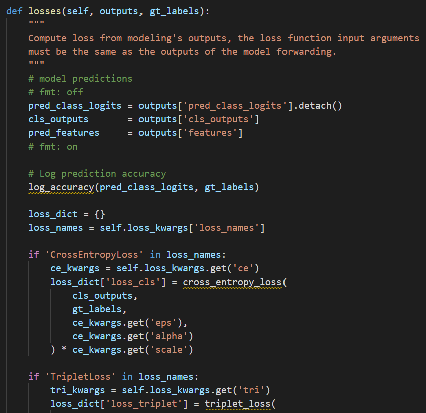

如果是训练模式会把heads的输出输入到losses中得到损失函数，用于反向传播计算梯度


------

最后看一下整个的框架构成

- ### [关于整个fastreid的文件管理系统配置](https://github.com/L1aoXingyu/Deep-Learning-Project-Template)

整个fastreid的框架是基于Deep-Learning-Project-Template的框架进行二次搭建的，该框架构建完善，分类清晰任务明确，如有需要可自行查看，笔者建议深度学习的框架都可参考此框架

<!--yacs是一个轻量级用于定义和管理系统配置的开源库，是科学实验软件中常用的参数配置。在机器学习、深度学习模型训练过程中的超参数配置（卷积神经网络的深度，初始学习率等）。科学实验的重现性至关重要，因此，需要记录实验过程中的参数设置，以达到后期进行实验的重现。yacs使用一种简单的，可读的yaml格式。-->
